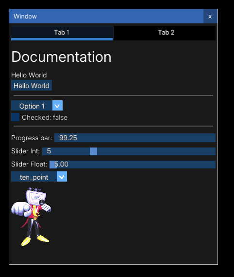

# creeperUI

A simple imgui-inspired "Immediate Mode GUI" rust crate for macroquad.



To get started, import the creeperUI crate and create a macroquad window:
```rust
use creeperUI::*;
use macroquad::prelude::*;

#[macroquad::main("Hello World")]
async fn main() {
    loop {
        next_frame().await
    }
}
```

## Creating the UI

Create the UI struct and pass in your font path (as a ttf file).
Make sure the UI struct is **mutable**.
```rust
use creeperUI::*;
use macroquad::prelude::*;

#[macroquad::main("Hello World")]
async fn main() {
    // I'm using the Arial font. (Put it inside `src/`)
    // If you really don't want to use a font, use `None`
    let mut ui = UI::new(Some("src/Arial.ttf"));
    
    loop {
        next_frame().await
    }
}
```

## Creating a Window

To make a window, call `ui.begin` and pass the `id` of the window inside the loop. Then call `ui.draw()` before next_frame.
```rust
loop {
    ui.begin("id");
    
    ui.draw();
    next_frame().await
}
```
When you run the program now, you'll have a fully functional UI window.

---

## Handling Mouse Input for Windows

If your app / game requires mouse input, creeperUI doesn't
have a way to block the mouse but you can use `ui.taken` to decide whether to do something.

`ui.taken` is a boolean that tells the user whether the UI currently has access to the mouse.
```rust
use creeperUI::*;
use macroquad::prelude::*;

#[macroquad::main("Hello World")]
async fn main() {
    let mut ui = UI::new(Some("src/Arial.ttf"));
    
    loop { 
        ui.begin("id");
    
        if !ui.taken && is_mouse_button_pressed(MouseButton::Left) {
            println!("This will only run if mouse is not inside the window.")
        }
    
        ui.draw();
        next_frame().await
    }
}
```

---

# Widgets

Any content inside the window is made of widgets. These include things like text, buttons, sliders, images, etc.

Call the widget's method on the window, and pass the required arguments.

Some widgets require you to pass an ID as the first argument.
You can just write `()` as the ID and some of this can be handled by the library,
however you can call the `gen_id!()` macro to generate a *"unique"* id
(and add an optional string inside of it if you're making many widgets on the same line).

### Here's some widget examples:

```rust
win.text("Label");        // No ID for this one
win.button(id, "Label");  // Use the `.clicked` property to check if its clicked
win.separator();          // No ID for this one, 

// `checked` boolean tells the dropdown to be checked by default
// use the `.value` property to check if it's checked
win.checkbox(id, "Label", checked);

// size is an Option<Vec2> from macroquad
// images need to be loaded, so you must `await`
win.image(id, "path_to_image.png", size).await;

// takes a vector of options, and also takes a default value
// in this case theres 2 things in the dropdown, and option1 is chosen by default
// use `.value` to get the value of the dropdown
win.dropdown(id, vec!["option1", "option2"], "option1");

// SLIDERS
// SliderInfo is a struct that tells the slider how to behave
// SliderInfo::Int and SliderInfo::Float
// use `.value` to get the value
// value is always an f64 (just cast the float to an int)
win.slider(id, "Label", SliderInfo::Int {
    min: 1,
    max: 15,
    default_value: 5,
});

// Same as a slider, but you can't drag it physically
// also uses ProgressInfo struct instead of SliderInfo
win.progress_bar(id, "Label", ProgressInfo);

// Tabs are kinda like dropdowns, but horizontal
// They take a vector of options and the default value (as a number)
// use `.value` to get the current selected tab.
// then use an if-statement or scope_if to spawn the UI based on the current tab
win.tabs((), vec!["Option1", "Option2", "Option3"], 0);
```

# Window Properties

Some window methods set properties of the window. These are all chainable.
Stuff like `set_pos` and `set_size` take macroquad's `Vec2` and also take an ActionType.
(It just tells the method to run either `Once` or `EachFrame`)

```rust
win.set_pos(vec2(300.0, 200.0), ActionType::Once)
    .set_size(vec2(300.0, screen_height()), ActionType::EachFrame)
    .set_draggable(false)
    .set_resizable(false)
    .set_closable(false)
    .set_active(false); // Sets window to be selected (also puts it in front)

// Windows are active on creation by default
```

You can also set a bunch of properties all at once
using `set_properties` and passing in the `WindowProperties` struct:
```rust
// Position and size are set EachFrame
// Set these to `None` if you don't want to set them
win.set_properties(WindowProperties {
    position: Some(vec2(0.0, 0.0)),
    size: Some(vec2(300.0, screen_height())),
    draggable: false,
    resizable: false,
    closable: false,
    ..Default::default()  // Implements some of Window's default properties
})
```

---

# Scopes

Sometimes you don't want to leave your window out in the open, or may accidentally
write code for the wrong window. This is where scopes come in handy. These are also chainable and
return the window.

```rust
let win = ui.begin("");

// takes a closure with `win` parameter that doesn't return anything
win.scope(|win| {
    win.text("Hello World");
});

// only runs when a *condition* is met (can be converted to boolean)
// and takes a closure with `win` parameter that doesn't return anything
win.scope_if( CONDITION, |win| {
    win.text("Hello World");
});

// takes a async-closure with `win` parameter that doesn't return anything
// call `.await` on it or it won't work
win.scope_async( async |win| {
    win.text("Hello World");
}).await;

// only runs when a *condition* is met (can be converted to boolean)
// takes a async-closure with `win` parameter that doesn't return anything
// call `.await` on it or it won't work
win.scope_async_if( CONDITION, await |win| {
    win.text("Hello World");
}).await;
```

Yeah thats all for now, you can probably understand everything from the source code.